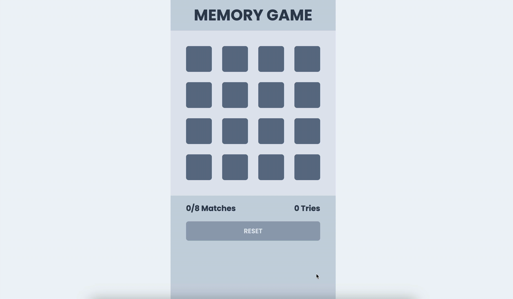

# HackerRank Challenge: Memory Game

## Challenge Description

You are given a React application that implements a Memory Game. The game consists of a grid of colored blocks that need to be matched in pairs. Each block has a pair color, and the order of the blocks is randomized. The player can click on two blocks, and if they match in color, they are considered a pair. The game keeps track of the number of matches and tries. The goal is to match all the blocks in as few tries as possible. Unflipped blocks should be colored using slate.

### Task

Your task is to complete and enhance the existing code to meet the following requirements:

1. Ensure that the game logic is functioning correctly, allowing the player to select two blocks and determining if they match.

2. Display a message when the player successfully matches all pairs with the following conditions:
   - If the player completes the game perfectly (minimum tries), display a message: "Congratulations, you have completed the game perfectly!"
   - If the player completes the game but with more tries, display a message: "Congratulations, you have completed the game!"

3. Implement a "Reset" button that allows the player to restart the game at any time. The "Reset" button should be disabled when there are no moves to reset.

4. Enhance the game to provide a clear display of the number of matches and tries to the player. The game should accurately keep track of the following:
   - The number of matched pairs.
   - The total number of tries made by the player.

### Input

- You will work with the provided React application and the `blocks` array containing block colors.

### Output

- Your solution should modify the existing application to meet the requirements specified above.

### Sample Input

```javascript
const blocks = [
  'red', 'yellow', 'green', 'indigo',
  'orange', 'red', 'yellow', 'green',
  'indigo', 'orange', 'cyan', 'pink',
  'stone', 'cyan', 'pink', 'stone'
]
```

### Sample Output

Your modified application should allow users to play the Memory Game with the specified requirements.

Figure 1 : Complete Flow


Figure 2 : Perfect Flow


**Note:**

- You can modify the existing code and add new components as necessary to meet the requirements.
- Ensure that the game is user-friendly and provides feedback to the player.
- Feel free to optimize and refactor the code as needed.
- Feel free to open [TailwindCss Documentation](https://tailwindcss.com/docs/utility-first)
- Feel free to open [MDN Documentation](https://developer.mozilla.org/en-US/)
- Feel free to open [ReactJs Documentation](https://react.dev/reference/react)
- Feel free to open [NextJs Documentation](https://nextjs.org/docs)